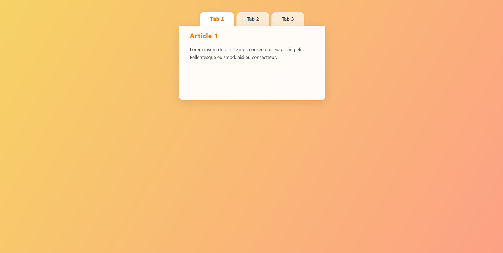

# Opgavebeskrivelse

Jeres opgave er at bruge HTML, CSS og Javascript til at lave en simpel hjemmeside, med nogle tabs der kan navigere frem og tilbage mellem artikler. Når der skiftes mellem artikler, skal der afspilles en lille animation af teksten der "glider" ud, og den nye tekst "glider" ind.

